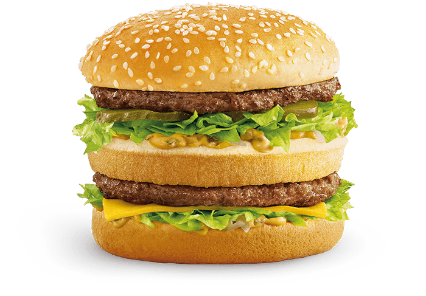

# McDonald's Big Mac Recipe

## Ingredients

- 1 sesame seed hamburger bun
- Half of an additional burger bun
- 1/4 pound of ground beef
- Salt
- 1 tblspn of thousand island dressing
- 1 teaspoon finely diced onion
- 1/2 cup chopped iceberg lettuce
- 1 slice American cheese
- 2 to 3 dill pickle slices

## Instructions

1. With a serrated knife, cut the top off the extra bun half, leaving about a 3/4-inch-thick slice. This will be the
middle bun of your sandwich.
2. Place the three bun's on a hot pan or griddle, face down, and toast them to a light brown. Set aside, but keep the
pan hot.
3. Divide the ground beef in half and press into two thin patties slightly larger than the bun.
4. Cook the patties in the hot pan over medium heat for 1 to 2 minutes on each side. Salt and pepper lightly.
5. Build the burger in the following stacking order from the bottom up:

- bottom bun
- half of special sauce
- half of onion
- half of lettuce
- American cheese
- beef patty
- middle bun
- remainder of special sauce
- remainder of onion
- remainder of lettuce
- pickle slices
- beef patty
- top bun

Makes 1 hamburger.